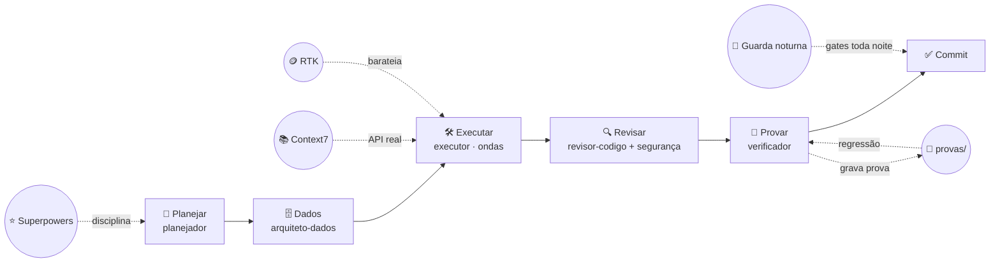

<a id="topo"></a>
<div align="center">

# 🧰 Toolkit de agentes


*Um time de agentes especialistas para o Claude Code — e o mapa de ferramentas
para código, design, vídeo, imagem e conteúdo.*

[](LICENSE)
[](https://docs.claude.com/en/docs/claude-code)
[](https://github.com/anthropics/claude-plugins-official)
[](#)

</div>

---

## 🧭 Índice

- [💡 A ideia](#a-ideia)
- [🚀 Comece por aqui](#comece-por-aqui)
- [🚦 Preciso de… → faça isto](#preciso-de)
- [🗺️ O fluxo](#o-fluxo)
- [🧑‍🤝‍🧑 O time](#o-time)
- [🧩 As skills](#as-skills)
- [🌙 O guarda noturna](#o-guarda-noturna)
- [🎯 Nichos](#nichos)
- [📚 Documentação](#documentacao)
- [📋 Prompts prontos](#prompts-prontos)
- [🙏 Créditos](#creditos)

---

## <a id="a-ideia"></a>💡 A ideia

Um fluxo de IA com uma regra que quase nenhum tem: **nada fecha sem alguém
executar o sistema de verdade.**

A sessão principal **orquestra**: entende o problema, decide, delega. Ela não
implementa. O trabalho vai para especialistas de escopo estreito, cada um com um
gatilho claro de "quando usar" e um **tier de modelo declarado** — busca em
arquivo não precisa do modelo mais caro; decisão de arquitetura precisa. No fim,
um agente que **não lê código** executa o fluxo real e volta com evidência. Sem
essa evidência, a tarefa não fecha.

Três coisas que a maioria das coleções não tem:

> [!IMPORTANT]
> **🧪 1. Prova de execução, não de leitura.** O `verificador` roda o sistema
> com JWT de usuário real — nunca com chave de serviço, que fura RLS e faz todo
> teste passar. Se não rodou, o veredito é NÃO PROVADO, e isso bloqueia o commit.
>
> **🔁 2. A prova vira suíte.** A skill `provas-de-regressao` grava o que o
> verificador executou em `provas/` e roda a suíte inteira antes de provar
> qualquer coisa nova.
>
> **💸 3. Custo como restrição de projeto.** Tier de modelo por agente. Busca no
> tier barato. Multiagente só nos três casos em que se paga.

## <a id="comece-por-aqui"></a>🚀 Comece por aqui

```bash
git clone https://github.com/giovannichitarrelli/toolkit-agents
cd toolkit-agents
./instalar.sh                 # 👀 prévia: mostra o que faria
./instalar.sh --aplicar       # 📦 copia agentes e skills para ~/.claude
```

Dentro do `claude`:

```
/plugin marketplace add anthropics/claude-plugins-official
/plugin install superpowers@claude-plugins-official
/plugin install context7@claude-plugins-official
/plugin install pr-review-toolkit@claude-plugins-official
/plugin install hookify@claude-plugins-official
```

Depois adapte os três arquivos de [`templates/`](templates/) à mão e reinicie a
sessão. Passo a passo em [📦 Instalação](docs/01-instalacao.md).

## <a id="preciso-de"></a>🚦 Preciso de… → faça isto

| Preciso de… | Comece por |
|---|---|
| 🆕 Feature nova | `planejador` → [fluxo](docs/02-fluxo.md) |
| 🐛 Consertar bug | `systematic-debugging` → `verificador` |
| 🗄️ Tabela, RLS, RPC | `arquiteto-dados` **antes** do código |
| 🚀 Publicar | `revisor-seguranca` + `verificador` |
| 🧬 Identidade visual | prompt [`06-extrair-design-system`](prompts/06-extrair-design-system.md) |
| 🖥️ Tela ou landing | [🎨 Design e UI](docs/nichos/design-ui.md) |
| 🎬 Vídeo | [🎬 Vídeo](docs/nichos/video.md) |
| 🖼️ Imagem, post, carrossel | [🖼️ Imagem](docs/nichos/imagem.md) |
| ✍️ Artigo de blog | `seo-geo` → `humanizer` |

Tabela completa em [🧭 Nichos](docs/nichos/README.md#-preciso-de--faça-isto).

<div align="right"><a href="#topo">▲ voltar ao topo</a></div>

---

## <a id="o-fluxo"></a>🗺️ O fluxo



O passo 🗄️ só entra quando a tarefa toca banco. O 🧪 nunca é opcional —
[por quê](docs/02-fluxo.md).

## <a id="o-time"></a>🧑‍🤝‍🧑 O time

| | Agente | Tier | Quando |
|---|---|---|---|
| 📝 | `planejador` | médio | Planeja antes de qualquer código. Tabela de tarefas e de ondas |
| 🛠️ | `executor` | **alto** | Implementa a partir de plano aprovado. O único no tier alto |
| 🗄️ | `arquiteto-dados` | médio | Schema, migration, RLS, índice, view, RPC, grant — **antes** do executor |
| 🔍 | `revisor-codigo` | médio | Bug, furo de fluxo, drift de contrato, hardcode |
| 🛡️ | `revisor-seguranca` | médio | Auditoria antes de publicar |
| 🧪 | `verificador` | médio | **Executa** o fluxo e volta com prova. Fecha a tarefa |
| 🤝 | `socio-produto` | médio | Pressiona a ideia antes de virar código |
| 🔎 | `seo-geo` | médio | SEO e otimização para assistentes de IA |
| 🐕 | `busca` | **barato** | Localiza código. Substitui `Explore` e `general-purpose` |

> [!TIP]
> Adapte o elenco aos **seus** domínios. Agente para domínio que você não tem é
> peso morto na tabela de roteamento.

## <a id="as-skills"></a>🧩 As skills

| | Skill | O que faz |
|---|---|---|
| 🌊 | `ondas-paralelas` | Plano em ondas: `Files:`/`Depends-on:`, arquivos disjuntos, e **implementador nunca commita** |
| 🧪 | `provas-de-regressao` | A prova do verificador vira script re-rodável; pega regressão antes de provar coisa nova |
| 🚦 | `quality-gates` | Gates de lint com severidade decidida pela contagem real de violações |

## <a id="o-guarda-noturna"></a>🌙 O guarda noturna

Um cron local que roda **os gates que o seu projeto já tem** e deixa um
relatório. Bash puro: **zero token**. Verde não imprime nada; vermelho abre a
primeira sessão do dia com o aviso.

[`templates/guarda-noturna/`](templates/guarda-noturna/) ·
[🌙 Guarda noturna](docs/06-guarda-noturna.md)

<div align="right"><a href="#topo">▲ voltar ao topo</a></div>

---

## <a id="nichos"></a>🎯 Nichos

Ferramentas, skills e conectores organizados por área. Cada página tem o kit,
quando usar cada peça, instalação e um prompt para começar.

| | Nicho | Destaques |
|---|---|---|
| 💻 | [Código](docs/nichos/codigo.md) | Superpowers · ondas · provas · quality gates · Context7 · Graphify |
| 🎨 | [Design e UI](docs/nichos/design-ui.md) | shadcn · 21st.dev · Magic UI · Dribbble · Behance · Mobbin · boas práticas |
| 🎬 | [Vídeo](docs/nichos/video.md) | Remotion · HyperFrames · claude-video · Higgsfield · Veo/Seedance · ElevenLabs |
| 🖼️ | [Imagem](docs/nichos/imagem.md) | Nano Banana 2 · Canva · Higgsfield |
| 🧪 | [Testes e navegador](docs/nichos/testes-navegador.md) | Claude in Chrome · Playwright · agent-browser · DevTools MCP |
| ✍️ | [Conteúdo e SEO](docs/nichos/conteudo-seo.md) | `seo-geo` · humanizer |
| 📄 | [Documentos](docs/nichos/documentos.md) | docx · pdf · pptx · xlsx |
| ⚡ | [Automação](docs/nichos/automacao.md) | n8n · guarda noturna · `/schedule` |

## <a id="documentacao"></a>📚 Documentação

### 📖 Fundamentos

| | Doc | |
|---|---|---|
| 🔭 | [Visão geral](docs/00-visao-geral.md) | Por que cada peça existe, e o que cada uma evitou |
| 📦 | [Instalação](docs/01-instalacao.md) | Do zero ao fluxo rodando |
| 🗺️ | [O fluxo](docs/02-fluxo.md) | Os sete passos, e por que o sexto não é opcional |

### ⚙️ Como funciona

| | Doc | |
|---|---|---|
| 🧪 | [Provas de execução](docs/03-provas.md) | O verificador e a suíte de regressão |
| 🌊 | [Ondas paralelas](docs/04-ondas.md) | Quando paralelizar é seguro, e quando é despesa |
| 💸 | [Custo](docs/05-custo.md) | Tier por agente, contexto como custo, proxy de tokens |
| 🌙 | [Guarda noturna](docs/06-guarda-noturna.md) | O worker que não gasta token |
| 🚦 | [Quality gates](docs/07-quality-gates.md) | Regra nova entra como aviso, nunca como erro |

### 🛠️ Ferramentas

| | Doc | |
|---|---|---|
| 🛠️ | [Ferramentas avaliadas](docs/08-ferramentas.md) | As 14 do vibe-coding-toolkit: o que já está, o que instalar, o que pular |
| 🪝 | [Hooks](docs/09-hooks.md) | Travas do hookify e hook que falha aberto |
| 🧭 | [Nichos](docs/nichos/README.md) | O mapa "preciso de X → use Y" |

## <a id="prompts-prontos"></a>📋 Prompts prontos

| | Prompt | Quando |
|---|---|---|
| 🧼 | [Sanidade do projeto](prompts/01-sanidade-do-projeto.md) | Mapa verificado de um repo |
| 🌊 | [Plano em ondas](prompts/02-plano-em-ondas.md) | Plano aprovado → ondas |
| 🔍 | [Review multiagente](prompts/03-review-multiagente.md) | Diff grande antes de commit |
| 🌙 | [Montar o guarda](prompts/04-montar-guarda.md) | Cron de gates num projeto |
| 🧪 | [Primeira prova](prompts/05-primeira-prova.md) | Depois de um PROVADO |
| 🧬 | [Extrair design system](prompts/06-extrair-design-system.md) | Entrevista: logo + referências → tokens |
| 🖥️ | [Tela a partir de referência](prompts/07-tela-a-partir-de-referencia.md) | Referência + tokens → tela |

➕ **9 prompts do vibe-coding-toolkit** (burndown de ESLint, memory bootstrap,
quebra de arquivo gigante…) em
[`prompts/vibe-coding-toolkit/`](prompts/README.md#-do-vibe-coding-toolkit-matheus-gomes).

<div align="right"><a href="#topo">▲ voltar ao topo</a></div>

---

## ✅ Requisitos

- 🤖 [Claude Code](https://docs.claude.com/en/docs/claude-code)
- ⭐ Plugin `superpowers` — `/plugin install superpowers@claude-plugins-official`
- 📚 Plugin `context7` — documentação atual de lib, contra API alucinada
- 🪙 Opcional: proxy de tokens ([`templates/RTK.md`](templates/RTK.md))

## <a id="creditos"></a>🙏 Créditos

<details>
<summary><strong>Em cima de ombros de gigantes — clique para expandir</strong></summary>

<br/>

A estrutura de documentação, as ideias de orquestração em ondas e de quality
gates como migração rastreada, e os prompts em
[`prompts/vibe-coding-toolkit/`](prompts/vibe-coding-toolkit/) vêm do
**[vibe-coding-toolkit](https://github.com/soumatheusgomes/vibe-coding-toolkit)**,
de Matheus Gomes, sob licença MIT. Os agentes, as skills, o guarda noturna, o
modelo de prova de execução e os guias de nicho são deste repositório.

Ferramentas de terceiros citadas nos nichos pertencem aos seus autores:
[Superpowers](https://github.com/anthropics/claude-plugins-official) ·
[Remotion](https://www.remotion.dev) ·
[HyperFrames](https://github.com/heygen-com/hyperframes) ·
[claude-video](https://github.com/bradautomates/claude-video) ·
[inference.sh](https://github.com/inference-sh/skills) ·
[ElevenLabs](https://github.com/elevenlabs/elevenlabs-mcp) ·
[Higgsfield](https://higgsfield.ai) ·
[Canva](https://www.canva.com) ·
[21st.dev](https://github.com/21st-dev/magic-mcp) ·
[shadcn/ui](https://ui.shadcn.com) ·
[Graphify](https://github.com/Graphify-Labs/graphify) ·
[agent-browser](https://github.com/vercel-labs/agent-browser) ·
[n8n-skills](https://github.com/czlonkowski/n8n-skills).

Leitura de origem:
[Building Effective Agents](https://www.anthropic.com/engineering/building-effective-agents)
e
[Multi-Agent Systems: When to Use Them](https://claude.com/blog/building-multi-agent-systems-when-and-how-to-use-them),
da Anthropic — o custo de 3–10× que a regra de ondas cita sai do segundo.

</details>

## ⚖️ Licença

MIT — veja [LICENSE](LICENSE).

<div align="center">

Feito com 🤖 + ☕, uma prova de cada vez.

</div>
