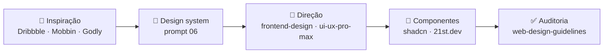

# 🎨 Design e UI (web e app)

O guia para abrir quando a pergunta for "de onde eu tiro isso?" — da
referência visual ao componente em produção.

## 🗺️ O caminho, em ordem



1. **👀 Inspiração** — junte 3 a 5 referências **antes** de pedir qualquer tela.
   Print vale mais que adjetivo: "moderno e clean" não diz nada ao modelo.
2. **🧬 Design system** — rode o prompt
   [`06-extrair-design-system`](../../prompts/06-extrair-design-system.md). Ele
   pergunta logo, cores, fonte, tom, e gera tokens + `DESIGN.md`. Sem isso cada
   tela inventa a própria paleta.
3. **🧭 Direção** — `frontend-design` ou `ui-ux-pro-max` para layout e
   hierarquia, já presos aos tokens.
4. **🧱 Componentes** — `shadcn` como base, 21st.dev para o componente
   "de vitrine" (hero, pricing, bento).
5. **✅ Auditoria** — `web-design-guidelines` + `revisor-codigo` caçando cor e
   espaçamento fora do token.

## 🧰 Skills e MCPs

| | Ferramenta | Tipo | Para quê | Status |
|---|---|---|---|---|
| 🖼️ | `frontend-design` ([anthropics/skills](https://github.com/anthropics/skills)) | skill | Interface com direção visual, longe do "visual genérico de IA" | ✅ |
| 🌈 | `ui-ux-pro-max` ([nextlevelbuilder](https://github.com/nextlevelbuilder/ui-ux-pro-max-skill)) | skill | Estilos, paletas, pares de fonte, guias de UX por stack | ✅ |
| 🧱 | `shadcn` ([shadcn/ui](https://ui.shadcn.com)) | skill + CLI | Adicionar, compor e consertar componentes shadcn | ✅ |
| ✨ | [21st.dev Magic](https://github.com/21st-dev/magic-mcp) | MCP | Gera e busca componentes React/Tailwind da comunidade 21st.dev direto no código | 🟢 |
| ✅ | `web-design-guidelines` ([vercel-labs](https://github.com/vercel-labs/agent-skills)) | skill | Auditoria de acessibilidade e boas práticas | ✅ |
| 🎨 | Canva | MCP | Peças de marketing a partir do mesmo design system | 🟢 ([🖼️ Imagem](imagem.md)) |

## 🧱 Bibliotecas de componente

Todas no modelo "copia o código para o seu projeto" (estilo shadcn) — você é
dono do componente, sem dependência travada.

| | Biblioteca | Melhor para |
|---|---|---|
| 🧱 | [shadcn/ui](https://ui.shadcn.com) | Base de tudo: form, tabela, dialog, menu. Comece aqui |
| ✨ | [21st.dev](https://21st.dev) | Marketplace da comunidade: hero, pricing, CTA, bento, landing inteira |
| 🪄 | [Magic UI](https://magicui.design) | Animação de landing: marquee, número animado, borda brilhante |
| 🌌 | [Aceternity UI](https://ui.aceternity.com) | Efeitos de vitrine: spotlight, parallax, 3D card |
| 🔷 | [Origin UI](https://originui.com) | Variações de input, select e botão prontas |
| 🎯 | [Lucide](https://lucide.dev) | Ícones (padrão do shadcn) |

> [!TIP]
> Efeito de vitrine é tempero. Uma landing com cinco componentes do Aceternity
> parece template; um efeito no hero e o resto sóbrio parece produto.

## 👀 Inspiração

| | Site | Use quando |
|---|---|---|
| 🏀 | [Dribbble](https://dribbble.com) | Estética, paleta, tratamento de card e ilustração. Cuidado: muito shot não é tela real |
| 🅱️ | [Behance](https://www.behance.net) | Case completo: identidade + aplicação, ótimo para entender um sistema inteiro |
| 📱 | [Mobbin](https://mobbin.com) | **Telas reais** de apps publicados, por fluxo (onboarding, checkout, paywall). A melhor referência para app |
| 🔥 | [Godly](https://godly.website) | Landing pages com movimento, curadoria forte |
| 🏆 | [Awwwards](https://www.awwwards.com) | Estado da arte em web, experimental |
| 📰 | [Land-book](https://land-book.com) · [Lapa Ninja](https://www.lapa.ninja) | Landing por categoria (SaaS, app, portfólio) |
| 🧩 | [Refero](https://refero.design) | Padrões de UI pesquisáveis por componente |

**Como passar referência para o agente:** print na pasta do projeto
(`design/referencias/`) e cite no prompt o **que** copiar de cada uma —
"o hero da ref-01, a densidade da tabela da ref-03". Referência sem instrução
vira cópia literal ou é ignorada.

## 🎨 Cor, fonte e ferramentas de apoio

| | Ferramenta | Para quê |
|---|---|---|
| 🎨 | [Realtime Colors](https://www.realtimecolors.com) | Testar paleta numa página real, exporta tokens CSS |
| 🌈 | [Coolors](https://coolors.co) | Gerar e travar paleta a partir de uma cor |
| 🔤 | [Google Fonts](https://fonts.google.com) | Fonte gratuita, carrega via `next/font` |
| ♿ | [WebAIM Contrast](https://webaim.org/resources/contrastchecker/) | Contraste AA/AAA de cada par texto/fundo |
| 📐 | [Figma](https://www.figma.com) | Se já existe arquivo de design, ele é a fonte da verdade |

## ✅ Boas práticas

- **Tokens antes de tela.** Cor, raio, espaçamento e fonte como variável CSS
  (`--primary`, `--radius`) — nunca hex solto no componente.
- **Uma fonte de display, uma de texto.** Mais que duas é ruído.
- **Escala de espaçamento fixa** (4/8/12/16/24/32/48). Valor fora da escala é bug.
- **Contraste AA mínimo** (4.5:1 texto normal). Cheque o dark mode separado.
- **Mobile primeiro** em app e landing: 375px de largura, alvo de toque ≥ 44px.
- **Estados completos**: vazio, carregando, erro, sucesso — tela sem estado
  vazio é tela que quebra no primeiro usuário.
- **Dark mode por token**, não por `dark:` espalhado em cada classe.
- **Copy real no layout.** Lorem ipsum esconde o título que não cabe.

## 📦 Instalação

```bash
npx skills add anthropics/skills
npx skills add nextlevelbuilder/ui-ux-pro-max-skill
npx skills add vercel-labs/agent-skills
npx skills add shadcn/ui

# ✨ 21st.dev Magic — pede API key em 21st.dev (variável API_KEY_21ST)
npx @21st-dev/cli@latest init --client claude
```

## 💬 Prompts deste nicho

- [`06-extrair-design-system`](../../prompts/06-extrair-design-system.md) —
  entrevista guiada que fecha o design system a partir da logo e das referências.
- [`07-tela-a-partir-de-referencia`](../../prompts/07-tela-a-partir-de-referencia.md) —
  da pasta de referências à tela pronta, presa aos tokens.
