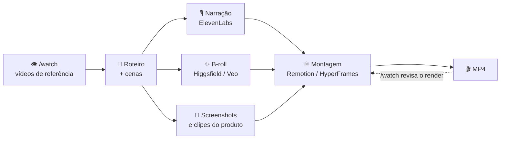

# 🎬 Vídeo

Duas famílias que resolvem problemas diferentes — e a maioria dos vídeos bons
usa as duas:

- **🎞️ Vídeo programático** — o vídeo é código (React ou HTML). Determinístico:
  mesma entrada, mesmo MP4. É o que você quer para demo de produto, vídeo de
  marca, legenda animada, versão em lote ("um vídeo por cliente").
- **✨ Vídeo generativo** — o vídeo sai de um modelo (Veo, Seedance, Kling…).
  Imagem que não existe, b-roll, cena cinematográfica. Não é reprodutível: cada
  geração custa crédito e sai diferente.
- **🔍 Análise de vídeo** — o Claude **assiste** um vídeo (URL ou arquivo) e
  devolve frames com timestamp + transcrição. Para estudar referência, revisar
  o próprio render, resumir aula ou extrair roteiro de concorrente.

## 🧰 O kit

| | Ferramenta | Tipo | Para quê | Status |
|---|---|---|---|---|
| ⚛️ | [Remotion](https://www.remotion.dev/docs/ai/skills) | skill · programático | Vídeo em React. Composições, animação, áudio, render para MP4 | 🟢 recomendo |
| 🧱 | [HyperFrames](https://github.com/heygen-com/hyperframes) (HeyGen) | skill · programático | Vídeo em HTML + CSS + GSAP. Mais leve que Remotion; o "Claude escreve e renderiza vídeo" | 🟢 recomendo |
| 🌀 | [Higgsfield](https://higgsfield.ai) | conector + CLI · generativo | Imagem e vídeo cinematográfico, presets de câmera | ✅ conectado |
| 🎥 | `ai-video-generation` ([inference.sh](https://github.com/inference-sh/skills)) | skill · generativo | Veo 3.1, Seedance, Wan, OmniHuman (avatar), lipsync, upscale | ✅ instalada |
| 🎙️ | [ElevenLabs](https://github.com/elevenlabs/elevenlabs-mcp) | conector · áudio | Narração, clonagem de voz, efeito sonoro, transcrição | ✅ conectado |
| 👁️ | [claude-video](https://github.com/bradautomates/claude-video) (`/watch`) | plugin · análise | Assiste YouTube/arquivo: frames + transcrição, recorte por tempo, motor local ou Gemini | 🟢 recomendo |

**Remotion ou HyperFrames?** Escolha **um** por projeto. Remotion se o projeto
já é React/Next ou o vídeo tem lógica (dados, lotes, variações). HyperFrames se
você quer o caminho mais curto do prompt ao MP4, sem montar projeto React.

## 🔁 O pipeline que funciona



O `/watch` entra nas duas pontas: antes, para destrinchar a referência
("que ritmo de corte esse vídeo usa?"); depois, para o Claude **ver** o MP4 que
renderizou em vez de presumir que ficou certo — é o `verificador` do vídeo.

A ordem importa: **narração antes da montagem.** A duração do áudio define o
tempo de cada cena; montar primeiro e encaixar a voz depois vira retrabalho.

## 📦 Instalação

```bash
# ⚛️ Remotion — dentro do projeto de vídeo
npx create-video@latest --yes --blank meu-video && cd meu-video
npx skills add remotion-dev/skills
npm run dev          # preview ao lado da sessão do Claude

# 🧱 HyperFrames
npx skills add heygen-com/hyperframes

# 🎥 Vídeo generativo via inference.sh (Veo, Seedance, Wan…)
npx skills add inference-sh/skills

# 🌀 Higgsfield no Claude Code (o conector do claude.ai cobre o chat)
npm i -g @higgsfield/cli && higgsfield auth login
npx skills add higgsfield-ai/skills
```

```
# 👁️ claude-video — dentro do claude; depois abra sessão nova e use /watch
/plugin marketplace add bradautomates/claude-video
/plugin install watch@claude-video
```

Requer Python 3.10+, `ffmpeg`/`ffprobe`, `yt-dlp` atual e Deno (para YouTube):
`brew install ffmpeg yt-dlp deno`. Chaves opcionais em
`~/.config/watch/.env` — `GEMINI_API_KEY` (grátis no AI Studio, liga o motor
Gemini) e `GROQ_API_KEY`/`OPENAI_API_KEY` (transcrição na nuvem). Sem chave,
roda local com WhisperX (≥ 8 GB de RAM).

```bash
# 🎙️ ElevenLabs — MCP oficial (requer uv)
claude mcp add elevenlabs --scope user \
  -e ELEVENLABS_API_KEY="$ELEVENLABS_API_KEY" -- uvx elevenlabs-mcp
```

> [!NOTE]
> Conector adicionado em **claude.ai → Configurações → Conectores** (como
> ElevenLabs e Higgsfield) já aparece no Claude Code quando você está logado
> com a mesma conta. O MCP local acima só é necessário se você quiser rodar sem
> o conector, ou num ambiente sem login do claude.ai.

> [!WARNING]
> Nunca coloque a chave da ElevenLabs num `.mcp.json` de projeto — ele é
> commitado. Escopo `user` grava em `~/.claude.json`, fora de qualquer repo.

## 💬 Prompt para começar

```
Usando a skill do Remotion, monte um vídeo de 30s em 1080x1920 apresentando
[PRODUTO]. Cenas: gancho (3s), problema (6s), 3 telas do produto (15s), CTA (6s).
Use os screenshots de [PASTA]. Gere a narração em pt-BR com a ElevenLabs
ANTES de montar, e ajuste a duração de cada cena ao áudio. Me mostre o preview
antes de renderizar.
```

```
/watch [URL do vídeo de referência] --detail balanced
Descreva a estrutura: duração de cada cena, ritmo de corte, onde entra o texto
na tela, tom da narração. Devolva como roteiro-modelo que eu possa reaproveitar.
```

## 💸 Custo

Generativo cobra por geração, e iteração é onde o crédito some. Itere no
**programático** (grátis, local) e chame o generativo só para a cena que
realmente precisa de imagem que não existe. No `/watch`, `--detail transcript`
é o mais barato; `token-burner` só quando o detalhe visual importa.
